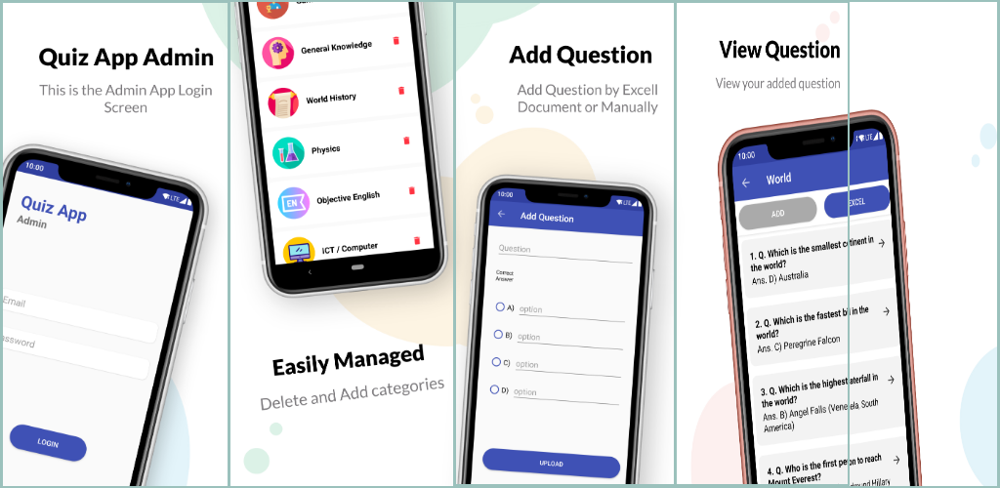
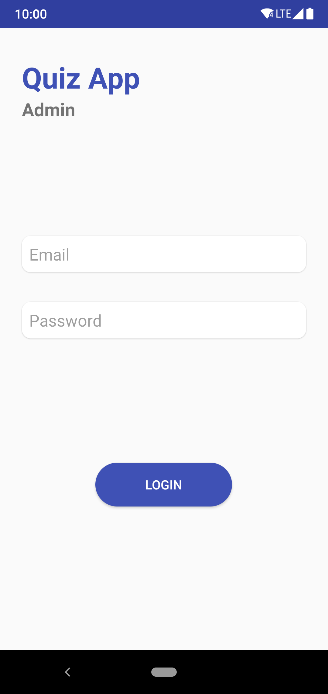
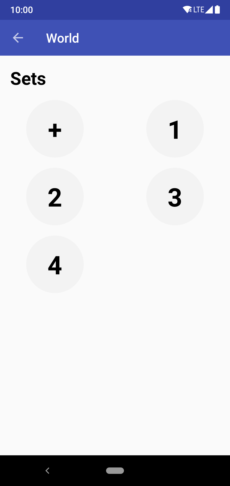
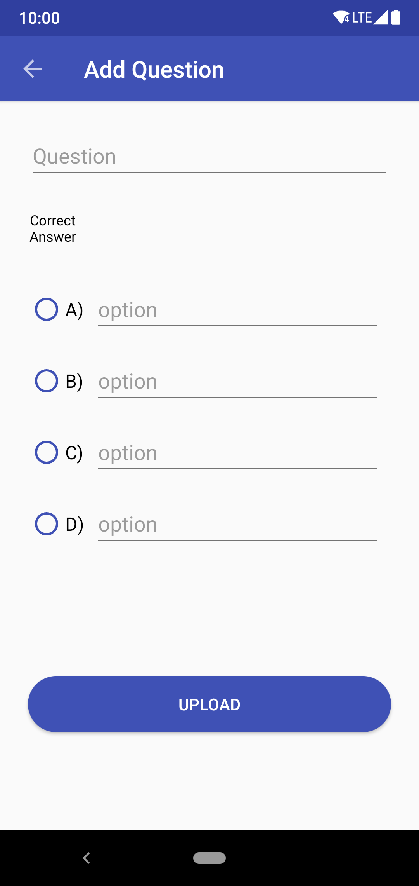
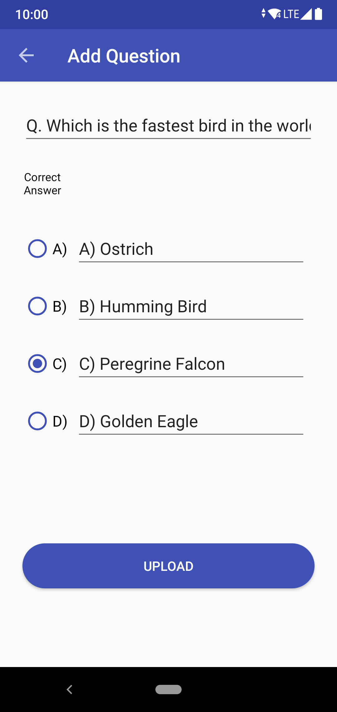

# Quiz App Admin
Making Admin App For Quiz App

1) Admin App Start with Login Screen (I Use Firebase For Login).

2) Load The Categories data From Firebase realtime database and some functinality for admin such as add, delete operation.

3) In here, Sets Model add operation by (+)btn and delete operation onLongpress a diloag box popup for delete warning.

4) Now Question Activity with some functinality like (add,delete). admin can added ques from excel shit too. (i use poi library for excel).

6) Add question through admin app

7) Edit question through admin app

# Thank You!

